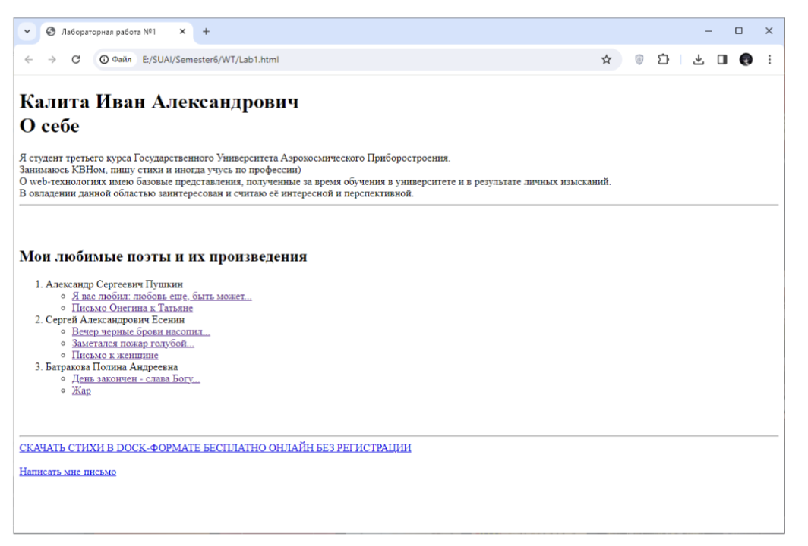
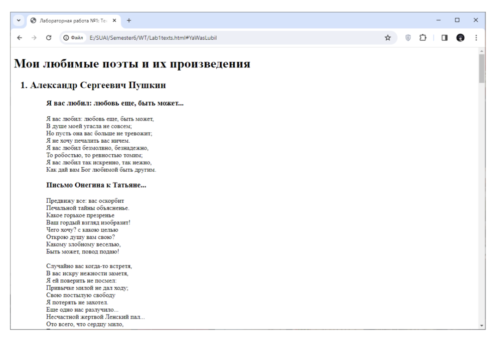
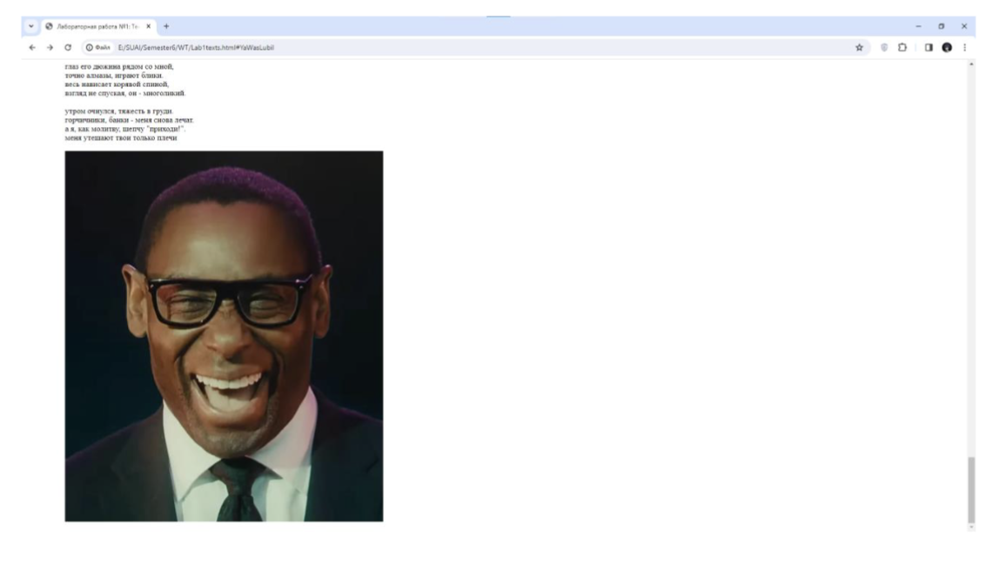
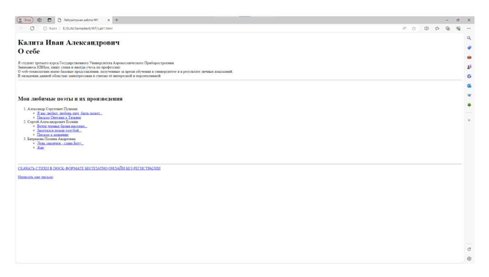
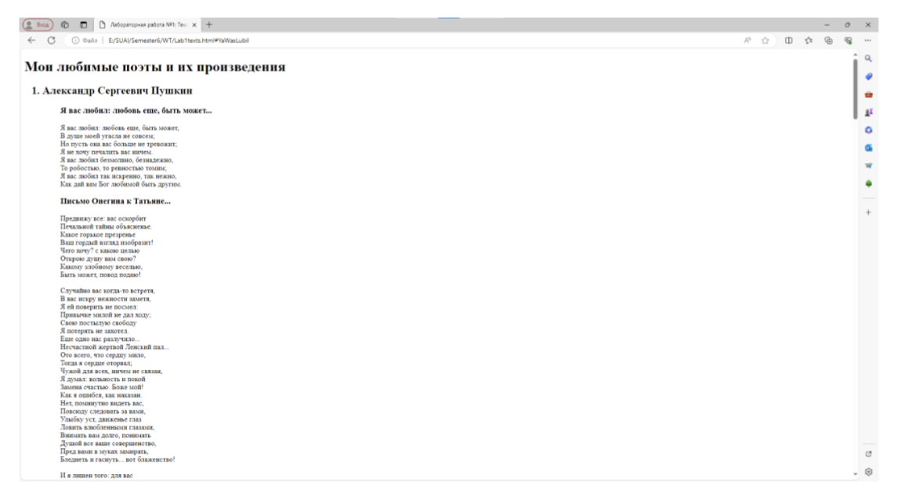
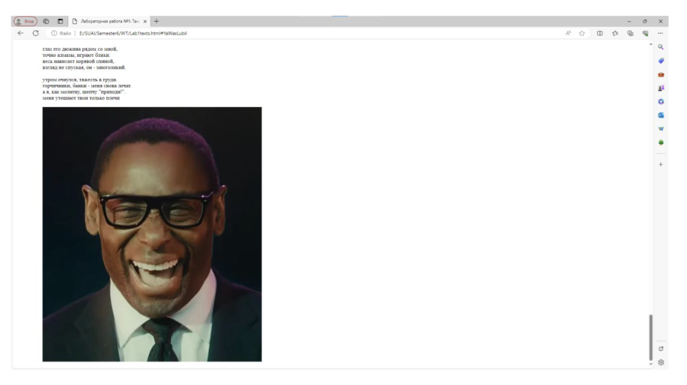

<!--markdownlint-disable no-trailing-spaces-->

# Постановка задачи

**Цель работы:** приобретение навыков создания web-документов,
структурирования и оформления текста средствами HTML 5.0, а также
создания текстовых и графических гиперссылок.

## Задание

**1 Часть:**

Создайте web-страницу с кратким текстом о себе и наличии (отсутствии)
подготовки в области web-технологий, о заинтересованности в овладении этой
областью информационных технологий. Текст должен начинаться с заголовка
1-го уровня, затем следует поместить текст, написанный базовым шрифтом.

Далее вставьте горизонтальную черту, добавьте 2-3 пустые строки,
после чего напишите заголовком 2-го уровня текст «Мои любимые поэты и их
произведения» и создайте вложенный список: нумерованный список с
фамилиями поэтов (двух-трех), а внутри каждого элемента нумерованного
списка напишите в виде маркированного списка названия стихотворений этого
поэта (не более двух-трех).

Создайте 2-ю веб-страницу, на которой поместите тексты
стихотворений (или их фрагменты), которые Вы перечислили на 1-ой
странице. Для выделения названий стихотворений используйте специальные
теги заголовков.

**2 Часть:**

1. На 1-ой веб-странице создайте из названий стихотворений поэтов
   гиперссылки, обеспечивающую переход на текст соответствующего
   стихотворения на 2-ой странице.

2. Создайте гиперссылку, нацеленную на текстовый документ с
   расширением .docx для его последующей загрузки.

# Выполнение работы

## Ход выполнения

Для выполнения поставленного задания были разработаны две HTML-
страницы, охватывающие все необходимые функциональные элементы.
Первая содержит информацию о авторе, список любимых поэтов и их
произведений с гиперссылками, ведущими на эти тексты на второй странице.
Снизу располагаются ссылка на скачивание `.docx` файла с текстом
стихотворений, а также почтовая ссылка автора. Вторая содержит тексты
стихов и изображение-ссылку, возвращающую на предыдущую страницу.

# Вывод

В ходе выполнения работы были получены навыки web-разработки, а
также выполнены поставленные задачи. Разработанные HTML-страницы
включают в себя все необходимые функциональные элементы, обеспечивая
полноценное функционирование веб-приложения.

Были проведены тесты в браузерах Google Chrome и Microsoft Edge,
результаты которых свидетельствуют о том, что все созданные HTML-
страницы работают корректно.

# Приложение <suaidoc-center>

**Листинг Lab1.html**

\lstinputlisting{Lab1.html}\hfill \break

**Листинг Lab1texts.html**

\lstinputlisting{Lab1texts.html}\hfill \break
